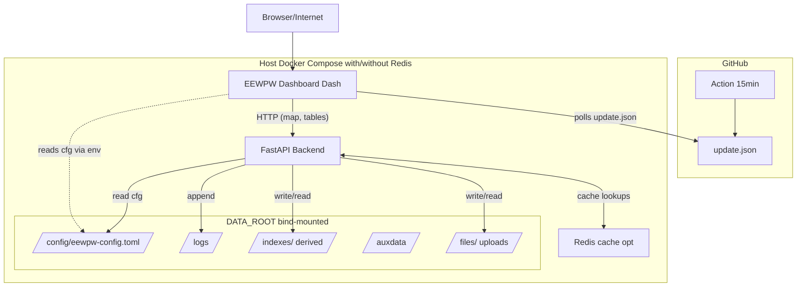

# EEWPW – Earthquake Early Warning Performance Viewer

<table>
  <tr>
    <td style="width: 300px; vertical-align: middle;">
      
    </td>
    <td style="vertical-align: middle;">
      <strong>EEWPW</strong> is a modular, open-source framework for analyzing and visualizing the performance of Earthquake Early Warning (EEW) systems. 
      It integrates real-time detections, playback data, and algorithm outputs into a unified, interactive platform for both scientific and operational use.
    </td>
  </tr>
</table>

---

## Key Features

- **Backend API** – FastAPI-based service for data management, uploads, indexing, and streaming  
- **Dashboard** – Dash/Plotly web application for interactive performance visualization  
- **Deployment Stack** – Docker Compose environment bundling backend, frontend, and Redis cache  
- **Update Channel** – Automated image digest tracking for version control and upgrade notifications  
- **Planned Expansion** – AI-driven parser and monitoring agent for automated log analysis and performance scoring

---

## Architecture Overview

## Repositories

| Repository | Description |
|-------------|-------------|
| [**eewpw**](https://github.com/eewpw/eewpw) | Docker Compose deployment with Makefile targets and smoke tests |
| [**eewpw-dashboard**](https://github.com/eewpw/eewpw-dashboard) | Interactive Dash/Plotly frontend for EEW performance visualization |
| [**eewpw-backend**](https://github.com/eewpw/eewpw-backend) | FastAPI backend providing data APIs, upload handling, and caching |
| [**eewpw-update-status**](https://github.com/eewpw/eewpw-update-status) | Provides image digests for update notifications |

----

